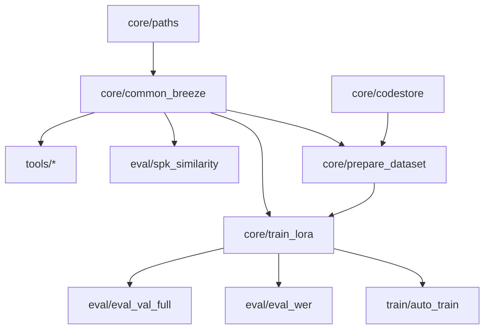

# `de_lora/` — project code (German LoRA for Breeze TTS 2)

This directory holds the training code of the fork (renamed from the template's
`ptbr_lora/`). The official engine (`breeze_infer/`, `models/`, `infer.py`) sits
at the repository root and is **unchanged**; weights and artifacts stay
**outside** git. The data tools of the German runs live in `../tools/`, the run
recipes in `../recipes/`, merge/deploy helpers in `../scripts/`.

> Repository entry point: `../README.md`.
> Documentation: `../docs/` (installation, configuration, data, training, evaluation).
> Paths/environment: `core/paths.py` + `.env` (see `../.env.example`).

## Module map

```
de_lora/
├─ core/     paths.py, common_breeze.py, codestore.py, prepare_dataset.py, train_lora.py
├─ data/     build_corpus_de.py, build_corpus_hui.py, build_corpus_hifitts2.py   (German runs)
│            build_corpus.py, download_datasets.py, tagarela_speakers.py         (pt-BR template)
├─ scraping/ podcast pipeline of the pt-BR template (00..05, api_check)
├─ train/    auto_train.py
├─ eval/     eval_val_full.py, eval_wer.py, spk_similarity.py
└─ tools/    analyze_model.py, smoke_forward_b.py, scan_alvos.py, analise_acentos.py
```

## Dependencies between modules



All scripts add `de_lora/core/` to `sys.path` automatically. The engine is
imported from the root of the fork (`paths.BREEZE_REPO`).

## Environment

```bash
export PTBR_ARTIFACTS=/path/to/artifacts   # or set it in the .env at the repository root
scripts/run.sh de_lora/core/train_lora.py --run smoke --smoke --steps 30
```

`scripts/run.sh` sets the MIOpen variables needed on ROCm, changes into the
repository root and runs the project's Python (`BREEZE_PY`, else `.venv/bin/python`,
else `python3`). Absolute machine paths were removed; adjust `PTBR_ARTIFACTS`
and, for the German sources, the variables listed in `core/paths.py`. Details in
`../docs/CONFIGURATION.md`.
